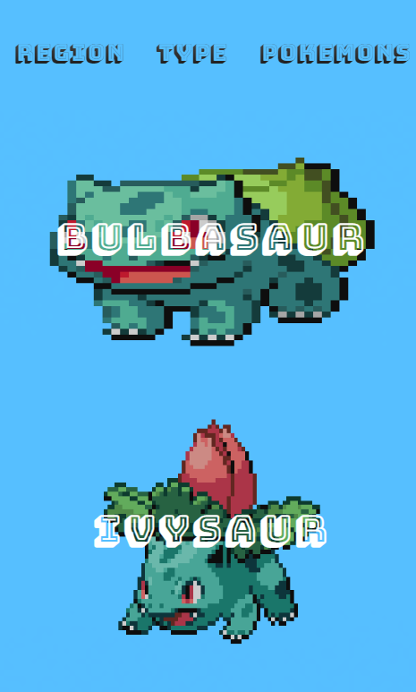
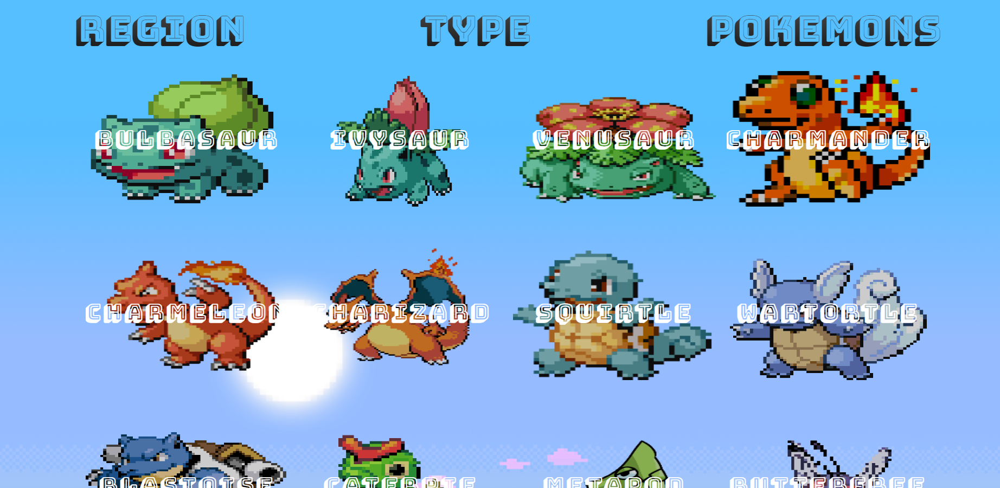

 

<h1><strong>CONSUMO API - pokemon</strong></h1>

|      MOBILE         |          DESKTOP       |
|:-------------------:|:-----------------------:
|||

[Clique aqui](https://dulcet-bublanina-b1c1bf.netlify.app/) para acessar o site. 

## **Escopo**

O objetivo do projeto é realizar o consumo de uma API Pública. Escolhi como tema Pokemon. 

- [Link da API](https://pokeapi.co/)

## **Tecnologias Utilizadas**

- HTML
- CSS
- Markdown
- Responsividade
- JavaScript
- Web Components
- Figma 

## **Figma**
Utilizando a ferramenta de design Figma, foi planejado o breakpoint. 
Segue o link: 

- [Link do Figma](https://www.figma.com/file/9uzdQpO3OPWmYatuhJJQ5U/POKEMON?type=design&node-id=0-1&t=Iv9Fmew3DckiUnAH-0)

## **Critérios de avaliação**

- [ ]  Documentou problemas, se encontrado, para futuras consultas?
- [x]  Foi criado o layout no figma?
- [x]  A página foi construída seguindo o planejado no Figma?
- [x]  A página funciona em dispositivos diferentes?
- [x]  Foi consumida a API escolhida?
- [x]  Foi criado web componentes?
- [x]  Foi criado um padrão de roteamente para as paginas?
- [ ]  As funções foram criadas seguindo à boa prática de responsabilidade única?
- [x]  Quando possível, foi criado funções puras?
- []  O projeto está publicado?
- [x]  Foi criado o arquivo README.md?

## **Autora**

| NOME                                                                                                                                                                                      |                                                     GITHUB                                                      |                                       FOTO                                       |
| :----------------------------------------------------------------------------------------------------------------------------------------------------------------------------------------- | :-------------------------------------------------------------------------------------------------------------: | :------------------------------------------------------------------------------: |
|  |      | </a> |